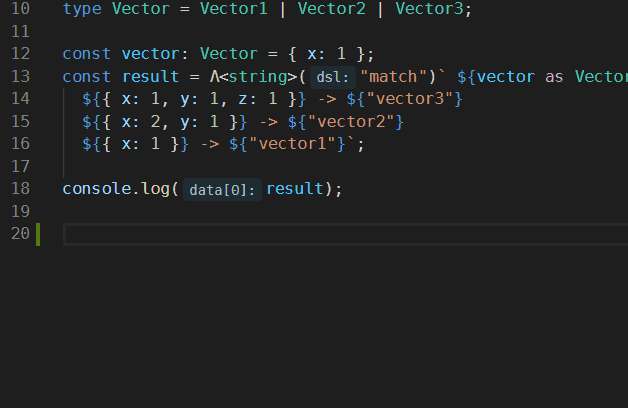

## TypeDraft Config

Before using a DSL, we have to register it in `typedraft.config.ts`. Create this file at the root of your project and export the config object.

For example, in [dsl-match-demo](https://github.com/mistlog/dsl-match-demo/blob/master/typedraft.config.ts), we have:

```ts title="typedraft.config.ts"
import { PatternMatch } from "draft-dsl-match";


/**
 * the default export will be the config object
 */
export default {
  DSLs: [{ name: "match", dsl: () => new PatternMatch() }],
};
```

The interface of this config object:

```ts
export interface ITypeDraftConfig {
  DSLs: Array<{ name: string; dsl: () => IDSL }>;
}
```

## Inplace DSL

In pattern match example: 

```ts title="vector.tsx"
import { MatchDSL } from "draft-dsl-match";

type Vector1 = { x: number };
type Vector2 = { x: number; y: number };
type Vector3 = {
    x: number;
    y: number;
    z: number;
};
type Vector = Vector1 | Vector2 | Vector3;

const vector: Vector = { x: 1 };
const result = Λ<string>("match")` ${vector as Vector} 
    ${{ x: 1, y: 1, z: 1 }} -> ${"vector3"}
    ${{ x: 2, y: 1 }} -> ${"vector2"}
    ${{ x: 1 }} -> ${"vector1"}
`;

console.log(result); // "vector1"
```

`Λ` is unicode `U+039B`, it resembles caret and is used to introduce a new context where you can apply a DSL, and ```<string>``` is used to assert the output type. "match" is the name of the DSL. You can customize it in typedraft.config.ts.

It's hard to type `Λ`, thus we recommend that you can create [code snippet](https://code.visualstudio.com/docs/editor/userdefinedsnippets) in vscode so that you can type it in this way:



The snippet you may want to reuse:

```json
{
    "dsl": {
        "scope": "javascript,typescript,typescriptreact",
        "prefix": "dsl",
        "body": ["Λ('$1')` $2`"],
        "description": "use dsl in typedraft"
    }
}
```

## Inline DSL

The syntax of inline DSL is:

```ts
...
{
    "use <dsl name>";
    ...
}
...
```

The name of DSL is registered in the config file, suppose that we have DSL named as "watch", which is used in [svelte-draft](https://github.com/mistlog/svelte-draft-tutorial/blob/master/src/examples/2-reactivity/reactive-declarations/App.tsx):

```ts title="demo.tsx"
export default function App() {
  let count = 0;

  function handleClick() {
    count += 1;
  }

  let doubled: number;

  {
    "use watch";
    doubled = count * 2;
  }

  <button onClick={handleClick}>
    Clicked {count} {count === 1 ? "time" : "times"}
  </button>;
  <p>
    {count} doubled is {doubled}
  </p>;
}
```

this gives:

```ts title="demo.ts"
...
$: {
  doubled = count * 2;
}
...
```